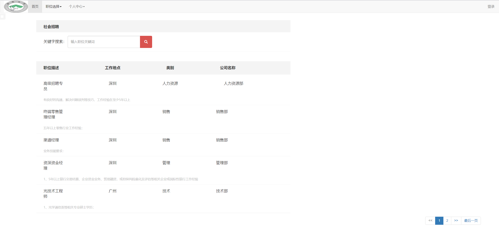
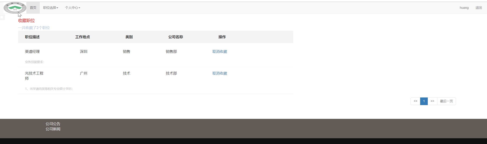

基于Springboot的求职招聘网站系统
=
### 完整代码获取地址：从戎源码网 ([https://armycodes.com/](https://armycodes.com/))
### 作者微信：19941326836  QQ：952045282 
### 承接计算机毕业设计、Java毕业设计、Python毕业设计、深度学习、机器学习
### 选题+开题报告+任务书+程序定制+安装调试+论文+答辩ppt 一条龙服务
### 所有选题地址https://github.com/nature924/allProject

一、项目介绍
---
基于SpringBoot框架的实现的求职招聘网站系统，本系统共分为2个角色：系统管理员、用户，主要功能如下
### 【前台功能】
用户角色功能：

1. 注册和登录：注册账户并登录系统，以便访问更多功能。

2. 个人信息管理：管理和更新个人信息，包括简历、联系方式、求职意向等。

3. 职位搜索和筛选：根据关键词、地点、行业等条件搜索职位，并进行筛选和排序。

4. 职位申请：通过网站申请感兴趣的职位，上传简历和附件。

5. 简历管理：创建和编辑个人简历，并将其保存在系统中，方便在职位申请时使用。

6. 消息通知：收到系统发出的消息通知，如面试邀请、职位更新等。

### 【后台功能】

系统管理员角色功能：

管理员菜单功能：

1. 简历管理：查看和管理用户提交的简历，包括查看简历详情、下载简历、标记简历状态等操作。
2. 问答管理：管理用户的问题和回答，包括查看问题列表、审核问题、回答问题、删除问题等操作。
3. 职位管理：发布新的职位，包括职位描述、要求、薪资等信息，修改已发布的职位信息，删除职位等操作。
4. 用户管理：查看用户列表，包括注册信息和个人信息，审核用户注册申请，禁用账户等操作。
5. 公司管理：管理公司信息，包括添加新的公司、编辑公司信息、删除公司等操作。
6. 职位类别管理：管理职位的类别，包括添加新的职位类别、编辑职位类别、删除职位类别等操作。
7. 职位申请进度管理：查看和管理用户的职位申请进度，包括审核、面试、录用等环节的管理。
8. 问卷类别管理：管理问卷调查的类别，包括添加新的问卷类别、编辑问卷类别、删除问卷类别等操作。

二、项目技术
---
- 编程语言：Java
- 数据库：MySQL
- 项目管理工具：Maven
- 前端技术：VUE、HTML、Jquery、Bootstrap
- 后端技术：Spring、SpringMVC、MyBatis

三、运行环境
---
- 操作系统：Windows、macOS都可以
- JDK版本：JDK1.8以上都可以
- 开发工具：IDEA、Ecplise、Myecplise都可以
- 数据库: MySQL5.7以上都可以
- Tomcat：任意版本都可以
- Maven：任意版本都可以

四、运行截图
---
### 论文截图：

### 程序截图：

